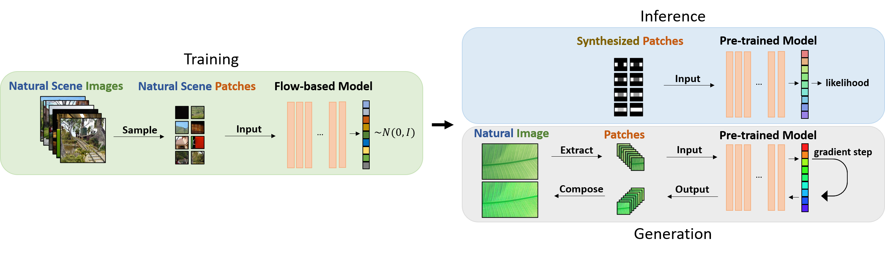

# VI-Glow
PyTorch code for our paper: "Color Visual Illusions: A Statistics-based Computational Model", NeurIPS 2020

Preprint version on [ArXiv](https://arxiv.org/abs/2005.08772).



# Usage

**Install Requirements**
```
pip3 install -r requirements.txt
```

**Prepare your data**

Download an external dataset, i.e. [Places](http://places2.csail.mit.edu/download.html).

This implementation uses `torchvision.datasets.ImageFolder`. Therefore, the images should be arranged as follows:

```
+-- <dataset_folder>
|   +-- <class_folder>
|   |   +-- *.png
|   +-- <class_folder>
|   |   +-- *.png
```

**Training**

1. Prepare a profile file (such as `profile/patch16.json`)
2. Run the training script:
```
python train.py [profile]
```
You can download a pretrained model from [here](https://cgm.technion.ac.il/Computer-Graphics-Multimedia/Software/VIGlow/pretrained_p16.pth).

**Generate Likelihood Graphs**

1. Make a folder with a sequence of input images (structure of `torchvision.datasets.ImageFolder`)
2. Prepare a profile file (such as `profile/patch16_graph.json`)
3. Run the script:
```
python image_patch_graph.py [profile] --output_path <output_folder> --var_name <X label, i.e. Hue>
```

**Generate Likelihood Heatmap**

1. Prepare a profile file (such as `profile/patch16_heatmap.json`)
2. Run the script:
```
python image_heatmap.py [profile] --output_path <output_folder>
```

**Manipulate Images**

1. Generate a mask for your image (it should have the same name as the image but located in another folder). 
2. Prepare a profile file (such as `profile/patch16_manipulation.json`)
3. Run the script:
```
python image_heatmap.py [profile] --output_path <output_folder> --mask_folder <mask_folder>
```

# Citation
We hope you find our work helpful for your research. 

If you are using our code, please consider citing our paper.
```
@article{hirsch2020color,
  title={Color Visual Illusions: A Statistics-based Computational Model},
  author={Hirsch, Elad and Tal, Ayellet},
  journal={Advances in Neural Information Processing Systems},
  volume={33},
  year={2020}
}
```

# Acknowledgements
This project uses source files of [corenel/pytorch-glow](https://github.com/corenel/pytorch-glow).

We also acknowledge the official repository of [Glow](https://github.com/openai/glow), by OpenAI.
